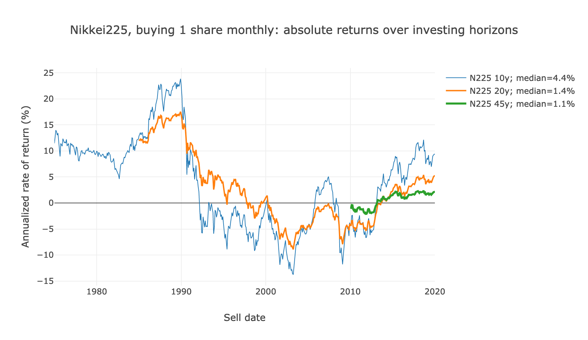

# Shiller Heat
Heatmaps and horizon analysis of investing in the S&P 500 between 1871 to 2019, courtesy of Robert Shiller's [*Irrational Exuberance*](http://www.econ.yale.edu/~shiller/data.htm) data set.

Also, the same analysis but for the Nikkei 225 between 1964 and 2019, courtesy of Yahoo! Finance.

## View the website at ***[https://fasiha.github.io/shiller-heat/](https://fasiha.github.io/shiller-heat/)***

***[https://fasiha.github.io/shiller-heat/](https://fasiha.github.io/shiller-heat/)***

## Notes

The conventional wisdom about retirement investing, established by greats as John Bogle, the late founder of Vanguard, and Warren Buffet (see his 2007–2017 personal bet that the S&P500 would beat hedge funds), is you set aside a percent of your income each month to buy a low-cost, tax-sheltered stock market index.

The body of research from the 1960s and ’70s showing that such index funds outperform professional investment managers is quite unimpeachable.

But.

The thing that always rankled me about all this was that it so often isn’t sufficient. This project, using historic data from [Robert Shiller](http://www.econ.yale.edu/~shiller/data.htm) and [Yahoo! Finance](https://finance.yahoo.com/quote/%5EN225/history?period1=-157489200&period2=1550293200&interval=1mo&filter=history&frequency=1mo), answers the question:

**If I followed the conventional wisdom over a lifetime, buying a stock market index each month, how much would I end up with when I’m about to retire?**

### S&P 500: the America story

### Nikkei 225: the Japan story

### Discussion

For the S&P 500 chart above (a live graph is available at this project's [website](https://fasiha.github.io/shiller-heat/)), I assume someone invests the monthly CPI (consumer price index) in the stock market every month, and reinvests dividends. The CPI is a column in Shiller’s dataset, and it can be seen as a proxy to wages (though it seeks to measure personal expenses). After a lifetime of investing (fifteen to forty-five years), they sell all their stock and calculate their annualized rate of return.

For the Nikkei 225 chart above (also available as a live interactive graph at this project's [website](https://fasiha.github.io/shiller-heat/)), CPI isn’t available, so I assume the investor bought one share’s worth of the Nikkei 225 index every month.

The median return of all forty-five-year lifetimes since 1871 in the American stock market is found to be 5.9%. Someone following the conventional wisdom is just as likely to see their conventional-wisdom-driven retirement savings grow by more than 5.9% as less than 5.9%.

That… is… actually pretty good: most businesses would love to grow 6% a year before taxes and all the other complications reduce the numbers. But that’s a far cry from the 9% my financial planner uses in their projections.

The best forty-five-year lifetime rate of return to date, since 1871, is 10.3%, assuming you sold all your accumulated shares in on New Year’s 2000, at the top of the Tech Bubble. Few generations have seen a lifetime of investing pay off that handsomely!

The *worst* forty-five-year lifetime rate of return is -3.1% for those who sold everything in May 1932, in the depths of the Great Crash; if they had waited a few years to retire, they might have turned that around to see a lifetime return of +3%.

When I see the range of these lifetime returns, with the middle half of the histogram (the 25th and 75th percentiles) as 2.5% and 7.4% annualized rate of return, I get fearful. I worry that I, or if not me then my children (or if not then then likely their children) will see abysmal returns. The research showing that hedge funds or professional stock pickers couldn’t outperform that will be poor comfort to someone entering retirement with very little to show for a lifetime of saving. I don’t think the retirement advice industry is preparing its clients for that.

The story in Japan is different but informative. The Japan bubble burst in the early 1990s, and it’s not hard to say the Japanese stock market (and the Japanese economy) has moved very little in the intervening thirty years. There are only eight years’ worth of data for forty-five-year lifetimes, since my dataset from Yahoo! Finance only begins in in 1964 (1964 + 45 = 2009, and its now 2019), but over those years the median lifetime rate of return has been 0.9%.

I am not personally sure how widespread the Bogle–Vanguard conventional wisdom on retirement savings is in Japan, so I’m not sure how many Japanese retirees looked back on a lifetime of saving amounting to -2% to +2%, but I think it is instructive to consider the possibility of Japan’s case happening in America. The S&P 500 has *never* seen a ten-year period where all forty-five-year lifetimes were ≤2% (it came close during World War II), but its likelihood is non-negligible, and I wonder if enough investors saving for retirement are weighing these possibilities.

Or even these realities.

—Ahmed Fasih ([contact me](https://fasiha.github.io/#contact); [see source code](https://github.com/fasiha/shiller-heat))