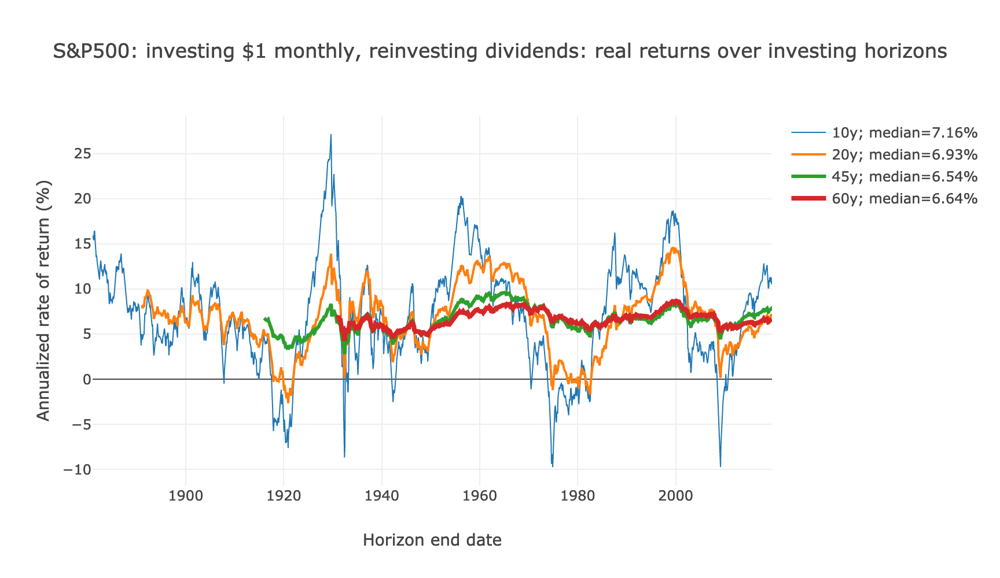

# Shiller Heat
Heatmaps and horizon analysis of investing in the S&P 500 between 1871 to 2019, courtesy of Robert Shiller's [*Irrational Exuberance*](http://www.econ.yale.edu/~shiller/data.htm) data set.

Also, the same analysis but for the Nikkei 225 between 1964 and 2019, courtesy of Yahoo! Finance.

## View the website at ***[https://fasiha.github.io/shiller-heat/](https://fasiha.github.io/shiller-heat/)***

***[https://fasiha.github.io/shiller-heat/](https://fasiha.github.io/shiller-heat/)***

## Notes

The conventional wisdom about retirement investing, established by greats as John Bogle, the late founder of Vanguard, and Warren Buffet (see his 2007–2017 personal bet that the S&P500 would beat hedge funds), is: set aside a percent of your income each month to buy a low-cost, tax-sheltered stock market index.

The body of research from the 1960s and ’70s showing that such index funds outperform professional investment managers is quite unimpeachable.

But.

The thing that I've always wondered about is if this was sufficient to trust something as important as your retirement to. So I looked at the historic data from [Robert Shiller](http://www.econ.yale.edu/~shiller/data.htm) and [Yahoo! Finance](https://finance.yahoo.com/quote/%5EN225/history?period1=-157489200&period2=1550293200&interval=1mo&filter=history&frequency=1mo), answers the question:

**If I followed the conventional wisdom over a lifetime, buying a stock market index each month, what would be my lifetime rate of return?**

### S&P 500: the America story

Let's assume an investor buys a dollar of the S&P 500 every month, reinvesting dividends. The real (inflation-adjusted) annualized returns over all short and long horizons since 1871 is shown below.

The median return of all forty-five year horizons is 6.5% annualized. Depending on when you lived, if you followed the conventional wisdom, your lifetime rate of return would just as often be more more than 6.5% as less.

6.5%. That's, actually, pretty good—most businesses would love to grow 6% a year. But that’s a far cry from the 9% my financial planner uses in their projections, especially when range of real returns over all forty-five year horizons seems to range between 3% (1887 to the bottom of the 1932 crash) and 9.6% (1920 to 1965).

As a risk-averse person, I'm not happy with the high chances of seeing just 5% returns over my investing lifetime. The knowledge that active fund managers couldn't outperform that will be poor comfort as I delay or trim retirement due to insufficient savings.

> Notes. I assume the existence of a zero-fee to invest in fractions of the S&P 500. Of horizons that exclude the Great Crash, the worst forty-five year real return was 4.8% (1937 to 1982). The most recent forty-five year horizon ending in 2019 returned 7.8% annually.

### Nikkei 225: the Japan story
I don't have Japanese CPI data, so assume an investor bought one share of the Nikkei 225 every month. Nominal returns over several horizons since 1965 are shown here.

The story in Japan is different from the S&P 500 but also informative. The Japan bubble burst in the early 1990s, and the Japanese stock market has moved little in the intervening thirty years. There are only nine years’ worth of data for forty-five-year lifetimes, since my dataset from Yahoo! Finance only begins in in 1965 (1965 + 45 = 2010, and its now 2019), but over those years the median rate of return over forty-five years has been 1.1%.

I don't know how many Japanese retirees subscribed to the Bogle–Vanguard school of thought and look back on a lifetime of investing returning between -2% and +2%. The numbers would likely be better because of dividends (which my dataset lacks), but just considering an equivalent of the Japanese bubble bursting in your home country. To me, as a risk-averse investor, the likelihood is not negligible and it gives me a lot of pause before entrusting my retirement to this conventional wisdom.

—Ahmed Fasih ([contact me](https://fasiha.github.io/#contact); [see source code](https://github.com/fasiha/shiller-heat))

> Earier versions of this essay had an unfortunate bug in the code that caused it to under-estimate long-term performance. Apologies.